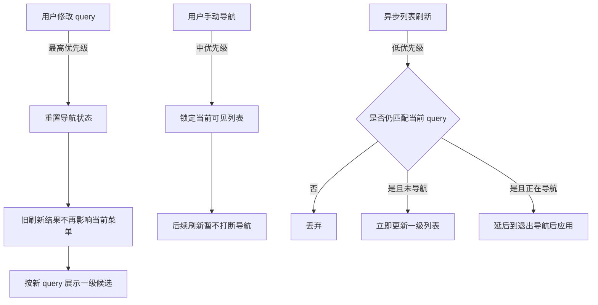
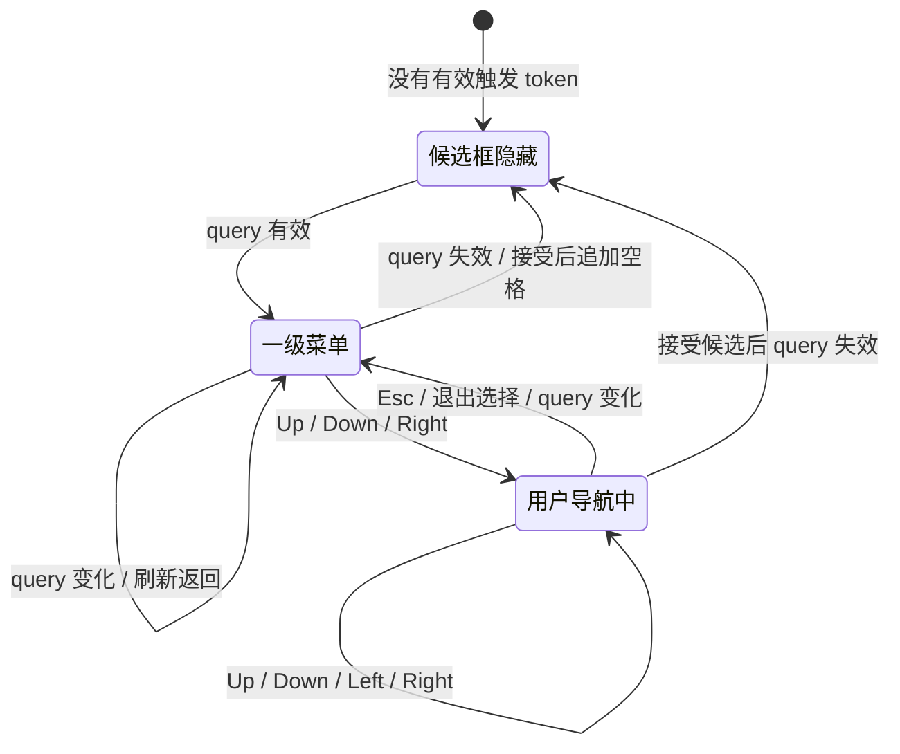
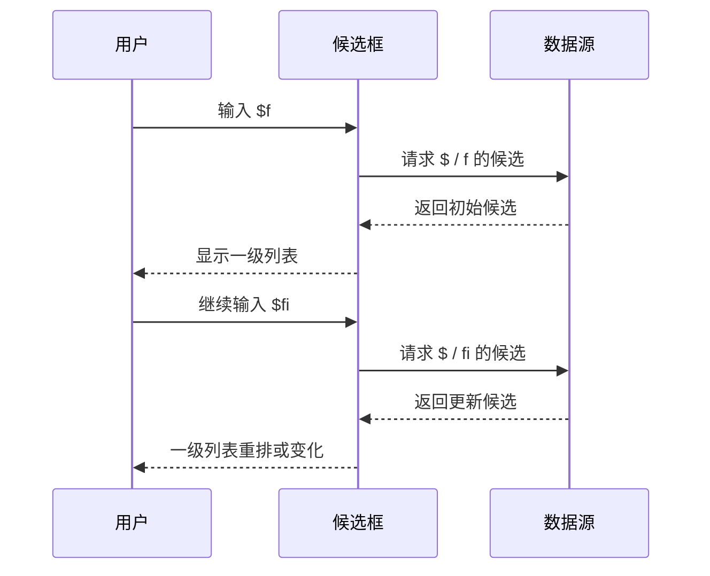
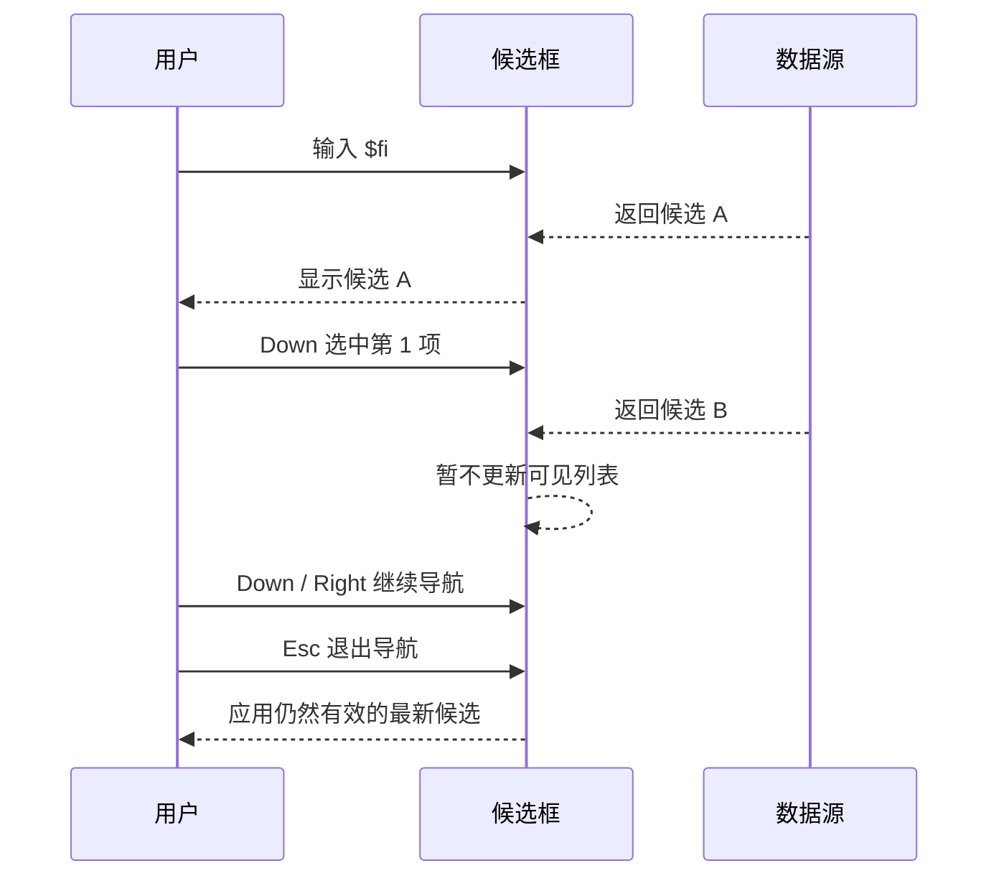
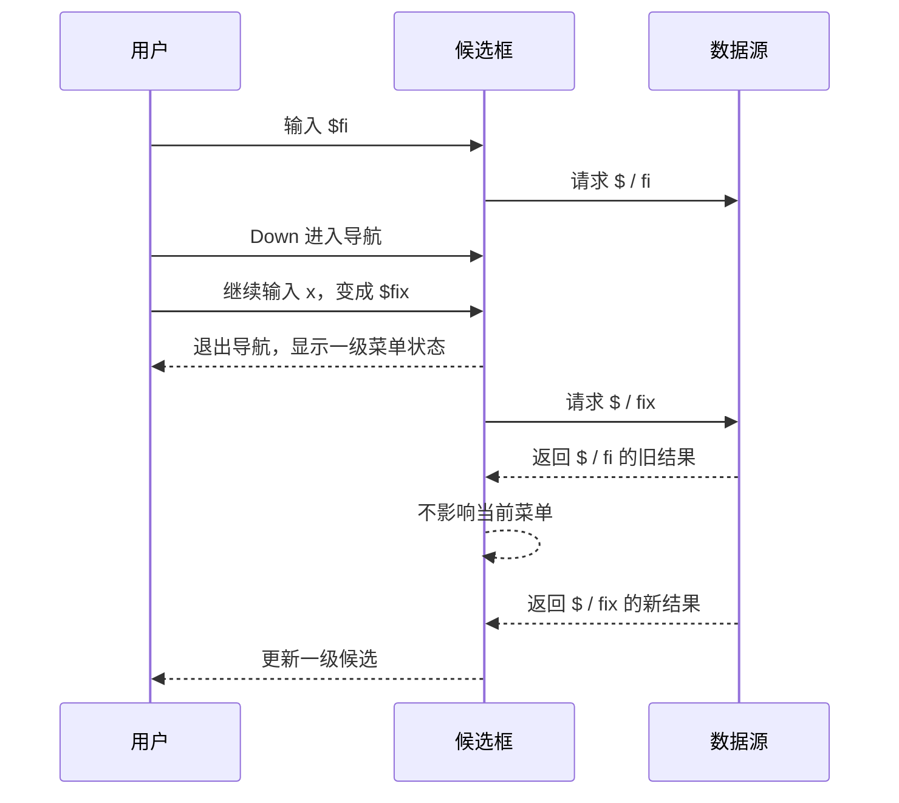
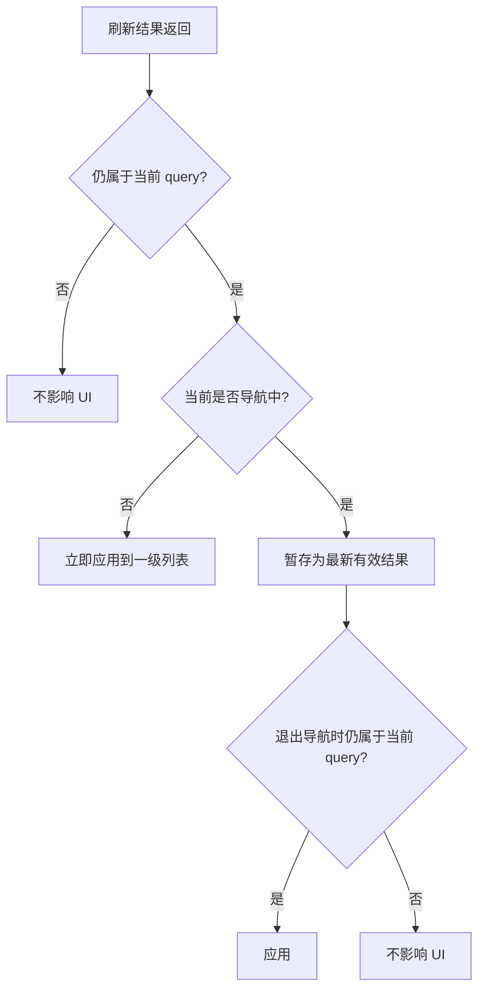
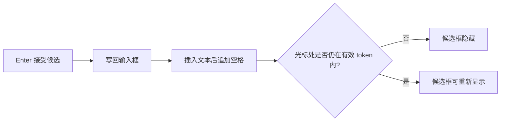

# 自动补全异步数据源交互行为设计

## 目标

在 UI 样式和基础触发行为稳定后，自动补全需要接入真实数据源。本文只描述用户可见行为和事件交错规则，不设计接口形状、类结构或具体实现。

核心目标：

- 允许多个特殊字符触发补全，例如 `$`、`@`、`#`。
- 每个特殊字符只对应一个数据源。
- 数据源可以异步刷新候选列表。
- 数据源可以根据当前 query 排列候选顺序。
- 数据源不决定当前选中项，也不决定菜单层级导航状态。
- 用户没有进入导航状态时，候选框永远只显示一级菜单。

## 概念边界

| 概念 | 含义 | 行为边界 |
| --- | --- | --- |
| 触发字符 | 启动补全的特殊字符 | 可以有多个；不同字符可以接不同数据源 |
| query | 触发字符后面的当前文本 | query 变化代表一次新的补全上下文 |
| 候选列表 | 当前 query 下可展示的一级候选 | 可以异步变化、重排、增删 |
| 导航状态 | 用户已经用键盘在候选列表里选择或展开 | 用户意图从“输入查询”切到“选择候选” |
| 接受 | 用户确认某个候选并写回输入框 | 不额外维护“已接受”状态 |

## 总体心智模型

自动补全按优先级处理三类事件：



优先级顺序固定为：

| 优先级 | 事件 | 原则 |
| --- | --- | --- |
| 1 | 用户修改 query | 立即生效，重置导航，旧刷新不能影响当前结果 |
| 2 | 用户手动导航 | 保护用户正在看的列表，避免选中项跳动 |
| 3 | 异步列表刷新 | 只在不干扰用户选择时更新 UI |

## 状态图



状态说明：

| 状态 | 展示 | 允许刷新改变列表 | 允许输入 |
| --- | --- | --- | --- |
| Hidden | 不显示候选框 | 不展示 | 是 |
| Browsing | 只显示一级菜单 | 是 | 是 |
| Navigating | 显示当前导航层级 | 否，延后应用 | 是 |

## 多触发字符和数据源

触发字符决定当前补全上下文。不同触发字符之间互不继承导航状态。

| 输入片段 | 当前上下文 | 行为 |
| --- | --- | --- |
| `$ski` | `$` 数据源 | 展示 `$` 对应候选 |
| `@ali` | `@` 数据源 | 展示 `@` 对应候选 |
| `$ski @ali` 且光标在 `@ali` 内 | `@` 数据源 | `$ski` 不影响当前候选 |
| `$ski` 改成 `@ski` | 从 `$` 上下文切换到 `@` 上下文 | 重置导航并按 `@` 重新刷新 |

每个触发字符只对应一个数据源。用户切换触发字符时，也就是切换到另一个数据源。

```mermaid
flowchart LR
    A[触发字符 + query] --> B{触发字符}
    B -->|$| C[$ 数据源]
    B -->|@| D[@ 数据源]
    B -->|#| E[# 数据源]
    C --> F[一级候选列表]
    D --> F
    E --> F
    F --> G[候选框]
```

当前触发字符对应的数据源可以影响候选顺序，但不能影响以下交互状态：

- 当前是否处于导航状态。
- 当前选中哪一项。
- 是否打开二级菜单。
- 回车接受哪个候选。

## 非导航状态

非导航状态是用户持续输入 query 的默认状态。此时列表应该尽量跟随数据源刷新。



行为规则：

| 场景 | 行为 |
| --- | --- |
| query 仍有效 | 候选框保持显示 |
| query 后续文本变化 | 重置选择，继续显示一级菜单 |
| 数据源返回更多结果 | 可立即更新一级列表 |
| 数据源重排结果 | 可立即重排一级列表 |
| 当前没有候选 | 显示空状态或隐藏，按后续 UI 策略固定 |

非导航状态允许列表逐步变化。用户停下来时，候选可以随着异步数据源完成而继续补齐、重排。

## 导航状态

用户按方向键进入候选列表后，当前可见列表进入保护状态。保护的目标是避免“用户正要选中某项时，列表突然变了”。



行为规则：

| 场景 | 行为 |
| --- | --- |
| 导航中刷新返回 | 不改变当前可见列表 |
| 导航中有多个刷新返回 | 只保留最新的有效结果，等待退出导航 |
| 导航中 query 没变 | 退出导航后可以应用最新结果 |
| 导航中 query 变了 | 立即退出导航，旧刷新结果失效 |
| 导航中回车接受 | 接受当前可见选中项，不等待刷新 |

## query 修改

query 修改优先级最高。它代表补全上下文已经变化，原导航状态和旧候选都不能继续约束当前 UI。

query 修改包括：

- 触发字符变化。
- 触发字符后面的文本变化。
- 光标移动导致当前 token 变化。
- 输入空白导致当前 token 失效。
- 删除触发字符。



行为规则：

| 当前状态 | query 修改后的行为 |
| --- | --- |
| Hidden | 如果新 query 有效，则打开候选框 |
| Browsing | 重置一级列表选择，按新 query 刷新 |
| Navigating | 退出导航，折叠到一级，按新 query 刷新 |

导航状态下修改文本会取消导航。这是有意约束：输入行为优先于选择行为，可以避免选中项、子菜单和刷新结果之间产生复杂且不稳定的对应关系。

## 刷新返回

异步刷新返回时，先判断它是否仍属于当前 query。



用户可见效果：

| 场景 | 用户看到 |
| --- | --- |
| 快速输入 `$f`、`$fi`、`$file` | 只看到与当前 `$file` 匹配的结果 |
| 数据源慢返回旧结果 | 当前列表不回退 |
| 没有导航时新结果到达 | 列表可以补齐或重排 |
| 正在导航时新结果到达 | 当前选中项不跳动 |
| 退出导航后 | 如果 query 没变，列表更新到最新有效结果 |

## 接受候选

接受候选后不维护额外的“已接受”状态。候选框是否隐藏只由当前文本和光标是否仍满足触发规则决定。



行为规则：

| 场景 | 行为 |
| --- | --- |
| 接受后追加空格 | 当前 token 结束，候选框自然隐藏 |
| 光标回到已插入 token 内 | 重新满足触发条件时，候选框可以再次显示 |
| 接受时列表正在等待刷新 | 接受当前可见选中项，不等待刷新 |
| 接受后旧刷新返回 | 不重新打开候选框，除非当前光标又满足触发条件 |

这个规则让“接受”只是一次文本编辑，不额外引入已接受状态。候选框始终由文本和光标位置驱动。

## 三类事件交错矩阵

| 先发生 | 后发生 | 结果 |
| --- | --- | --- |
| query 修改 | 旧刷新返回 | 旧结果不影响当前菜单 |
| query 修改 | 新刷新返回 | 非导航时应用；导航时延后 |
| 用户导航 | 刷新返回 | 当前可见列表不变 |
| 用户导航 | query 修改 | 退出导航，按新 query 处理 |
| 刷新返回 | 用户导航 | 用户基于当前可见列表导航 |
| 刷新返回 | query 修改 | 已应用结果随 query 修改被替换或隐藏 |
| 用户接受 | 刷新返回 | 已接受文本不回滚；刷新只在当前光标仍有效时影响菜单 |

## 典型流程

### 输入中逐步刷新

| 步骤 | 用户动作 / 系统事件 | 状态 | 可见结果 |
| --- | --- | --- | --- |
| 1 | 输入 `$` | Browsing | 显示一级候选 |
| 2 | 输入 `f` | Browsing | 清选择，等待或显示 `$f` 候选 |
| 3 | 数据源返回 | Browsing | 列表更新 |
| 4 | 输入 `i` | Browsing | 清选择，等待或显示 `$fi` 候选 |
| 5 | 数据源再次返回 | Browsing | 列表补齐或重排 |

### 导航中保护列表

| 步骤 | 用户动作 / 系统事件 | 状态 | 可见结果 |
| --- | --- | --- | --- |
| 1 | 输入 `$fi` | Browsing | 显示一级候选 A |
| 2 | 按 `Down` | Navigating | 选中候选 A 的第一项 |
| 3 | 数据源返回候选 B | Navigating | 仍显示候选 A |
| 4 | 按 `Down` | Navigating | 在候选 A 内移动 |
| 5 | 按 `Esc` | Browsing | 应用候选 B，如果仍匹配当前 query |

### 导航中继续输入

| 步骤 | 用户动作 / 系统事件 | 状态 | 可见结果 |
| --- | --- | --- | --- |
| 1 | 输入 `$fi` | Browsing | 显示一级候选 |
| 2 | 按 `Down` | Navigating | 选中一项 |
| 3 | 输入 `x` | Browsing | 退出导航，变成 `$fix` 的一级菜单 |
| 4 | 旧 `$fi` 结果返回 | Browsing | 不影响当前菜单 |
| 5 | 新 `$fix` 结果返回 | Browsing | 更新一级候选 |

## 设计约束

- 用户输入永远优先于自动刷新。
- 导航状态不禁止输入。
- 导航状态下输入会取消导航。
- 非导航状态只显示一级菜单。
- 数据源可以排序候选，但不能选择候选。
- 刷新结果不能让当前 query 回退。
- 接受候选不产生额外状态，只产生文本变化。

## 非目标

本文不设计：

- 数据源接口签名。
- 数据源注册方式。
- 模糊匹配算法。
- 排序权重字段。
- 缓存策略。
- 错误提示样式。
- 多窗口共享补全状态。

这些内容应在行为边界稳定后单独设计。
