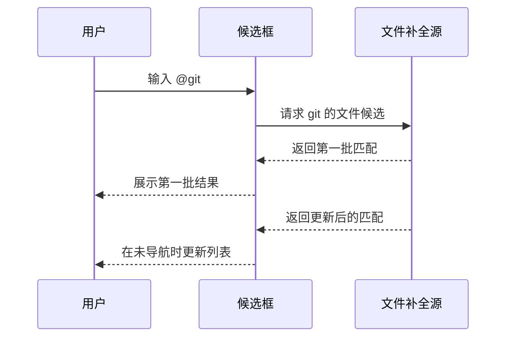

# 文件补全行为

## 目标

文件补全用于在 prompt 输入框中快速插入当前 workspace 内的文件路径，降低手动复制路径和在 Git 面板、文件管理器之间切换的成本。

首版只解决两个问题：

- query 为空时，优先展示最可能需要引用的文件集合。
- query 非空时，在全仓库文件中做模糊匹配，并允许结果异步逐步更新。

本方案只定义用户可见行为和数据来源语义。具体类结构、Git 命令封装、文件枚举实现和性能参数在实施方案中再展开。

## 触发入口

文件补全使用 `@` 作为触发字符。

用户在 prompt 输入框中输入满足自动补全触发规则的 `@token` 后，候选框展示文件候选。`@` 之后的文本称为 query。

示例：

```text
@
@readme
@Services/Git
```

文件补全复用自动补全框架的既有键盘行为：

- `Down` / `Up` 在当前列表中移动选择。
- `Enter` 接受当前选中项并写回输入框。
- `Esc` 退出当前选择态。

接受文件候选后，补全框架按既有规则替换当前 `@token`，并在插入文本后追加空格。

空 query 允许通过分组提供多级菜单；非空 query 暂时不提供多级菜单，文件候选都是可接受项。

## 空 Query 展示

当用户只输入 `@`，即 query 为空时，候选框展示预设文件集合。

首版只展示两组：

```text
Uncommitted
Recent committed
```

### Uncommitted

`Uncommitted` 表示当前 Git 工作区中尚未提交的文件。

候选来源包括：

- modified。
- added。
- conflicted。
- untracked。

展示时标题使用当前相对路径。

`Uncommitted` 在空 query 下先于 `Recent committed` 展示，因为这些文件通常最可能被当前 prompt 引用。

### Recent committed

`Recent committed` 表示最近若干次提交中提及过的文件。

它用于覆盖“刚完成或刚审阅过，但当前工作区已经干净”的文件引用场景。

首版固定读取最近 5 次提交。同一个文件被多次提交提及时，只展示一次；历史路径拍平去重后，只展示当前 working tree 中仍然存在的普通文件，rename / delete 历史项不单独展示。首版不按提交时间细分排序，去重后按文件相对路径名称稳定排序。

### 分组展示

空 query 下可以按两级结构展示：

```text
分组 -> 文件
```

示例：

```text
输入: @
一级列表:
- Uncommitted
- Recent committed
```

用户选中分组并进入下级后，展示该分组下的文件。

## 有 Query 时的搜索

当 query 非空时，候选框进入全仓库文件搜索模式。

此时不再展示 `Uncommitted` / `Recent committed` 分组，也不优先只查预设集合。文件补全直接面向当前 workspace 的全量文件候选做模糊匹配。

全量文件候选表示当前 workspace 中可被引用的普通文件路径，不包含目录。

首版匹配范围：

- 文件名。
- 相对路径。
- 路径片段。

匹配大小写不敏感。

示例：

```text
输入: @gitservice
一级列表:
- HaloCreek/Services/GitService.cs
```

具体模糊匹配算法不在行为文档中固定，但用户可见结果应满足：

- 文件名命中通常优先于深层路径片段命中。
- 连续片段命中通常优先于分散字符命中。
- 更短、更接近 query 的路径通常优先于很长的弱匹配路径。
- 排序稳定，同一 query 下结果不应无意义跳动。

## 异步逐步更新

非空 query 的全仓库文件搜索允许异步逐步更新结果。

用户输入 query 后，候选框可以先展示已经可用的匹配结果，再随着后台枚举或索引完成补齐更多结果。



逐步更新必须遵守自动补全框架的通用异步规则：

- query 变化后，旧 query 的后台结果不能影响当前候选框。
- workspace 切换后，prompt 输入框会清空，以避免旧 workspace 的后台文件搜索结果继续影响当前输入。
- 用户尚未进入键盘导航状态时，新结果可以补齐或重排列表。
- 用户已经进入键盘导航状态时，新结果不应打断当前选中项；退出导航后再应用仍然有效的最新结果。
- 接受候选时只接受当前可见选中项，不等待后台搜索完成。

## 写回格式

接受文件候选后写回相对路径，并保留触发字符：

```text
@HaloCreek/Services/GitService.cs
```

写回后追加一个空格，使当前 token 结束，候选框自然隐藏。

首版不写入绝对路径，不做 Windows 路径和 WSL 路径的双格式展示，也不自动给路径加引号。

## 排序规则

### 空 Query

空 query 下分组固定排序：

1. `Uncommitted`
2. `Recent committed`

两个分组内的文件都按相对路径名称稳定排序。

首版不按 Git 状态、提交时间、最近性或其他权重调整空 query 下的组内顺序。预设文件数量预期不多，保持名称排序更容易理解和验证。

### 非空 Query

非空 query 下只按全仓库模糊匹配结果排序。

排序信号建议包括：

- 文件名命中优先。
- 完整相对路径精确匹配优先。
- 路径连续片段命中优先。
- 更短路径优先。
- Git 高价值信号可以作为轻量加分，例如 uncommitted 或 recent committed 文件在同等匹配质量下靠前。

Git 高价值信号不能改变“非空 query 面向全仓库文件搜索”的基本行为。也就是说，非空 query 不应只返回 uncommitted 或 recent committed 文件。

## 性能边界

文件补全不能在 UI 线程同步扫描全仓库文件。

首版性能策略：

- 空 query 只读取小集合，可以暂时同步执行；如果观察到明显卡顿，再改成异步。
- 非空 query 的全仓库搜索必须异步执行。
- query 快速变化时，应取消或丢弃旧查询结果。
- 文件枚举应尊重 Git 忽略规则，避免把构建产物、依赖目录和 `.git` 内容纳入候选；未跟踪但未被忽略的普通文件需要展示。

如果文件枚举失败，候选框不应静默展示错误文件集合；可以展示空结果，并把失败原因记录到日志。

## 空状态

空 query 下：

- 如果 `Uncommitted` 和 `Recent committed` 都没有文件，候选框按自动补全框架的既有空状态展示。

非空 query 下：

- 如果当前已完成的搜索阶段没有匹配结果，可以展示空状态。
- 如果后台搜索仍在进行，空状态不应表达为最终失败。
- 后台搜索完成后仍无匹配，保持空状态。

首版不自动创建文件，不提示用户新建文件，也不跳转外部文件选择器。

## 非目标

首版不做：

- 文件夹导航模式。
- 输入 `@/` 后从 workspace root 逐层浏览。
- 目录候选或目录接受。
- 文件树 UI。
- 文件内容搜索。
- 语义搜索。
- 拼音搜索。
- 文件预览。
- 路径高亮。
- 最近使用学习排序。
- 文件系统 watch 和实时索引刷新。
- 跨 workspace 搜索。
- 打开文件、定位文件或外部编辑器动作。
- query 内空格匹配和带空格路径的专门写回格式。首版继续依赖现有 token 行为；如果后续实际体验或高频反馈证明必要，再扩展。

文件夹导航从交互上单独设计，后续不和本阶段的文件模糊补全混在同一份行为文档中。

## Git 历史集合边界

`Recent committed` 是启发式信息源，不是强一致文件索引。

实现上可用 `git log --name-only` 读取历史提示集合，但最终展示必须按上面的存在性和普通文件规则过滤。排序仍按相对路径名称稳定排序。

## 参考方案

本行为参考以下成熟工具的边界：

- VS Code Quick Open：面向快速文件跳转，强调最近文件和当前工作区文件之间的快速切换。
- JetBrains Search Everywhere：默认突出 recent files，搜索时面向项目文件并尊重排除目录。
- fzf / fd / ripgrep 生态：候选生成和模糊过滤分离，文件枚举通常异步、可取消，并尊重忽略规则。
- Git：`status` 适合 uncommitted 文件集合，`log --name-only` 适合 recent committed 文件集合，`ls-files --cached --others --exclude-standard` 适合尊重 ignore 的全量文件候选。
