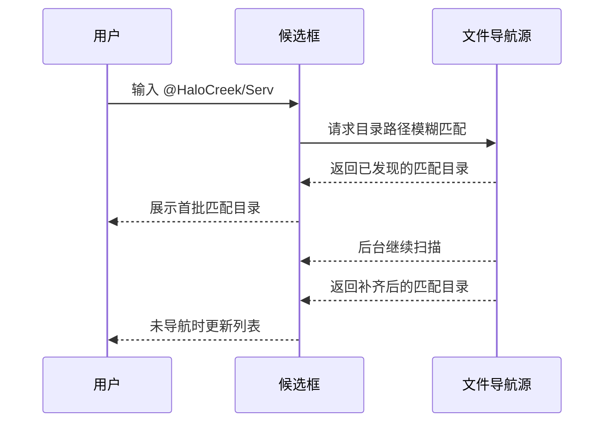

# 项目文件夹导航行为

## 目标

项目文件夹导航用于在 prompt 输入框中快速引用 workspace 内的目录，或者在用户只记得文件大致目录位置时，通过目录路径模糊匹配和目录导航逐步定位到目标文件。

本功能复用 `@` 入口，但只在 query 中出现 `/` 时启用项目路径模式。这样可以把“按文件名模糊搜索”和“按目录路径定位”拆成两个清晰模式，避免候选混在一起。

首版只定义用户可见行为和性能边界，不固定具体技术路线。实现可以采用流式扫描、轻量内存索引、后台刷新或这些方案的组合，只要满足本文行为约束即可。

## 触发入口

文件夹导航仍使用 `@` 作为触发字符。

`@` 后的 query 当且仅当包含 `/` 时，进入项目路径模式。

示例：

```text
@/
@HaloCreek/
@HaloCreek/Services/
@HaloCreek/Services/Comp
```

不包含 `/` 的 query 继续使用既有文件补全语义：

```text
@gitservice
@readme
```

也就是说：

| 输入 | 模式 |
| --- | --- |
| `@` | 空 query 文件补全集合 |
| `@git` | 文件模糊搜索 |
| `@/` | 在全项目目录路径中模糊匹配 `/` |
| `@HaloCreek/` | 在全项目目录路径中模糊匹配 `HaloCreek/` |
| `@HaloCreek/Serv` | 在全项目目录路径中模糊匹配 `HaloCreek/Serv` |

## 路径语义

项目路径模式中的路径都使用 workspace 相对路径。

query 中的 `/` 不要求表达一个已经精确存在的目录边界。它首先是“我要按项目目录路径搜索”的模式信号，同时也是模糊匹配的输入内容。

目录候选在展示和写回时使用 `/` 结尾：

```text
HaloCreek/
docs/
```

目录导航列表中的文件候选不追加 `/`：

```text
HaloCreek.sln
README.md
```

首版不展示绝对路径，不展示 Windows / WSL 双格式路径，不为带空格路径额外加引号。接受候选后仍由自动补全框架在插入文本后追加空格，使当前 token 结束。

## 展示模型

项目路径模式只有一种一级展示模型：全项目目录路径模糊匹配。

一级候选只包含目录，不包含文件；候选可以来自任意层级，不要求 query 的最后一个 `/` 之前已经精确匹配某个目录。

`@/` 不做特殊处理。它只是 query 为 `/` 的目录路径模糊匹配，实际展示取决于通用匹配和排序规则。

```text
输入: @HaloCreek/Services/Comp
候选:
- HaloCreek/Services/Completions/
- HaloCreek/Services/Completions/Files/
```

具体文件只在用户进入目录导航状态后出现。例如选中 `HaloCreek/Services/Completions/` 并按 `Right` 后，候选框展示该目录的直接子项，其中可以包含文件。

一级目录候选按路径匹配质量排序，并在同分时按相对路径稳定排序。

## Query 解释

项目路径模式不把 query 强制拆成“当前目录 + 当前段过滤词”，也不为某个 query 文本提供特殊语义。

只要 query 含 `/`，就统一在全项目目录路径中做模糊匹配。

示例：

```text
输入: @HaloCreek/Services/Comp
匹配目标: 全项目目录路径
可能候选:
- HaloCreek/Services/Completions/
```

`/` 参与匹配和排序，但不要求每一段都精确命中。实现可以把路径分段、连续片段、前缀命中作为排序信号，但用户可见行为应是“按项目目录路径模糊查找”。

如果用户希望只按文件名或不带斜杠的路径片段搜索，应删除 `/`，回到既有文件搜索模式。

## 键盘行为

导航模式复用自动补全框架的既有键盘行为，并增加目录导航语义。

基础行为：

- `Down` / `Up` 在当前可见列表中移动选择。
- `Enter` 接受当前选中项并写回输入框。
- `Esc` 退出当前选择态。

目录导航行为：

- 选中目录时，`Right` 进入该目录。
- 当前处于更深层级时，`Left` 返回上一层级。
- 当前处于本次键盘导航的最高层级时，`Left` 不再继续返回。

进入目录后，候选框展示目标目录的直接子项。返回上一级后，候选框展示父级列表，并尽量保留刚离开的目录为当前选中项。

最高层级是用户进入键盘导航状态时看到的一级菜单。例如用户输入 `@HaloCreek/Serv` 后按 `Down` 进入选择态，此时最高层级就是这组目录路径模糊匹配结果；之后连续按 `Right` 进入目录，再连续按 `Left`，最多只回到这组一级结果，不会继续改变 query 或跳到其他一级结果。

这里的目录导航状态和用户输入的 query 文本态是两个概念：

- 用户直接输入 `@HaloCreek/Serv` 时，展示全项目目录路径模糊匹配结果，不展示文件。
- 用户从某个目录候选按 `Right` 进入后，展示该目录的直接子项，此时可以展示并接受具体文件。

`Left` / `Right` 只改变候选框内部的导航层级，不改写用户输入框中的 query，也不改变本次键盘导航的最高层级。

## 接受候选

文件候选只在进入目录导航状态后出现。接受文件候选后写回文件相对路径，不保留触发字符：

```text
HaloCreek/Services/GitService.cs
```

一级目录路径匹配结果和目录导航列表中的目录项都可以接受。接受目录候选后写回目录相对路径，并保留末尾 `/`：

```text
HaloCreek/Services/
```

接受后自动追加空格：

```text
HaloCreek/Services/ 
```

这样目录引用可以直接交给 agent，表达“请关注这个目录”或“在这个目录里写文档”的意图。

## 异步逐步更新

项目路径模式允许异步扫描和逐步补齐结果。

含 `/` 的 query 允许逐步补齐目录路径匹配结果：



用户可见约束：

- 候选框应尽快给出可交互结果，不等待完整项目结构。
- 结果未完成时，用户仍然可以选择、进入目录或接受当前可见项。
- 接受候选时只接受当前可见项，不等待后台扫描完成。
- 后台扫描完成后，可以补齐当前目录路径查询结果或当前目录结果，但不能打断用户正在进行的键盘导航。

## 浅层优先

为了让目录路径匹配尽快可用，后台扫描建议采用浅层优先策略。

可接受的用户体验是：

1. 用户输入具体路径 query 后，已发现的高相关目录路径尽快出现。
2. 用户进入某个已发现目录后，该目录的直接子项优先补齐。
3. 深层目录可以晚于浅层目录出现。
4. 如果某个目录尚未扫描完成，进入后可以先展示已知子项，再逐步补齐。

本文不要求实现严格 BFS，也不要求扫描顺序在所有平台完全一致。行为目标是“用户越可能马上看到的层级，越早可用”。

## 不完整结构

项目路径模式不保证任意时刻展示完整项目结构或完整匹配结果。

以下情况都允许发生：

- 用户进入目录后，先看到部分子项，稍后补齐。
- 用户输入 `@HaloCreek/Serv` 时，先看到部分目录路径匹配，稍后补齐。
- 大项目中，深层目录在后台扫描完成前暂时不可见。
- 用户正在导航时，后台发现的新结果暂不刷新当前可见列表。

这些降级必须满足两个边界：

- 已经展示的路径必须是当前 workspace 中真实存在、可引用的路径。
- 后台结果不能把旧 query、旧 workspace、旧匹配模式或旧目录状态的候选写到当前菜单。

如果扫描失败，可以展示空状态或当前已知结果，并记录日志；不应伪造目录结构。

## 导航中的刷新

导航状态下，异步刷新不能导致当前选中项跳动。

规则沿用自动补全异步数据源交互行为：

- 用户尚未进入键盘导航状态时，新结果可以补齐或重排当前可见列表。
- 用户已经进入键盘导航状态时，新结果不应改变当前可见列表。
- 用户退出导航、改变 query、进入目录或返回上级后，可以应用仍然有效的最新结果。
- query 变化后，旧 query 的后台结果失效。
- workspace 切换后，旧 workspace 的后台结果失效。

导航模式比文件搜索更强调列表稳定性。即使后台发现了更完整的目录结构或更好的目录路径匹配，也不能在用户按 `Down`、`Up`、`Right`、`Left` 的过程中插入候选导致选中项漂移。

## 排序和过滤

含 `/` 的目录路径模糊匹配排序建议：

1. 只展示目录。
2. 路径连续片段命中优先。
3. 路径分段前缀命中优先。
4. 更短、更接近 query 的路径优先。
5. 同分时按相对路径稳定排序。

目录路径模糊匹配允许深层目录候选出现在结果中，不要求只展示某个当前目录的直接子项；但它不直接展示文件。

示例：

```text
输入: @HaloCreek/Services/Comp
候选:
- HaloCreek/Services/Completions/
- HaloCreek/Services/Completions/Files/
```

如果当前 query 暂时没有匹配项，候选框可以展示空状态。后台后续发现匹配目录时，可以按异步刷新规则补齐。

## 性能边界

项目文件夹导航不能在 UI 线程同步扫描全仓库。

首版性能策略：

- 含 `/` 的 query 可以触发后台扫描，但候选框首屏不等待完整扫描。
- 后台扫描应尊重 Git 忽略规则，避免把构建产物、依赖目录和 `.git` 内容纳入候选。
- 未跟踪但未被忽略的普通文件和目录需要纳入导航候选；其中普通文件只在进入目录导航状态后的目录列表中展示。
- 大项目中可以限制单次展示数量，避免一个目录下几千个子项撑爆菜单。
- 如果采用内存索引，应按 workspace 维度缓存，并在 workspace 切换时失效。
- 如果采用周期刷新，应继续使用旧的可用结果，后台刷新完成后再替换。

可感知降级：

- 极大项目中，目录路径模糊匹配可能先展示部分高相关结果。
- 极大目录中，候选可能只展示前若干个高相关项。
- 后台扫描未完成前，某些深层路径可能暂时找不到。

这些降级是可接受的，因为项目路径模式的主要目标是快速找到常见浅层目录和当前工作区内的高频路径，而不是提供强一致文件管理器。

## 空状态

项目路径模式下空状态可能表示三种情况：

- 当前目录真实为空，或当前目录路径 query 真实没有匹配项。
- 后台扫描尚未发现当前目录的子项。
- 后台扫描尚未发现当前目录路径 query 的匹配项。

首版可以统一展示自动补全框架既有空状态，不强制区分这三种原因。

如果后续需要更细体验，可以增加轻量状态：

- `Indexing project...`
- `No matching items`

但首版不要求额外解释文案，避免补全框承担过多状态说明。

## 和文件补全的关系

项目文件夹导航不是新的触发入口，而是 `@` 文件引用能力的路径模式。

两种模式的边界固定为：

| 模式 | 触发条件 | 主要目标 |
| --- | --- | --- |
| 文件搜索 | query 不含 `/` | 按文件名或路径片段快速找文件 |
| 项目路径模式 | query 含 `/` | 按目录路径模糊匹配，并支持目录导航 |

这意味着输入 `@Services` 仍走既有文件搜索；如果用户想按项目路径定位，应输入带 `/` 的路径片段，例如 `@HaloCreek/Serv`。

这个约束牺牲了一部分“目录名直接搜索”的便利性，换来更清晰的模式边界和更低的结果混淆。

## 非目标

首版不做：

- 独立触发字符。
- 完整文件树 UI。
- 强一致项目结构展示。
- 等待全仓库扫描完成后才允许导航。
- 文件内容搜索。
- 语义搜索。
- 拼音搜索。
- 路径高亮。
- 文件预览。
- 外部编辑器打开文件或定位文件。
- 文件系统 watch 实时刷新。
- 跨 workspace 搜索。
- 带空格路径的专门转义格式。

## 开放问题

以下问题留到实施方案中决定：

- 使用流式扫描、内存索引，还是二者结合。
- 是否在应用启动或 workspace 切换后预热路径索引。
- 单目录最大展示数量和大项目降级阈值。
- 导航状态内部如何表示目录层级和返回栈。
- 是否在目录项上提供明显的 pending 状态，表示该目录仍在扫描中。
