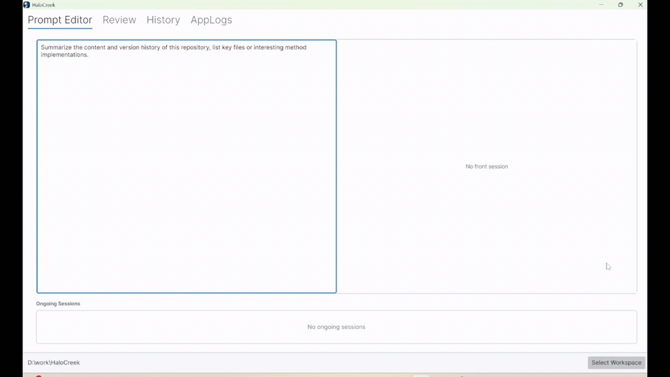
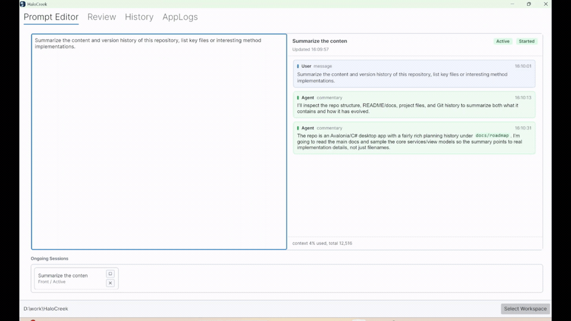
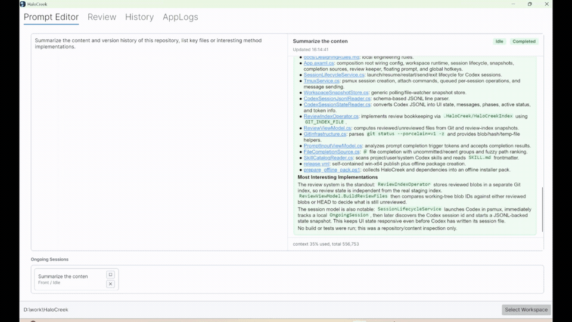
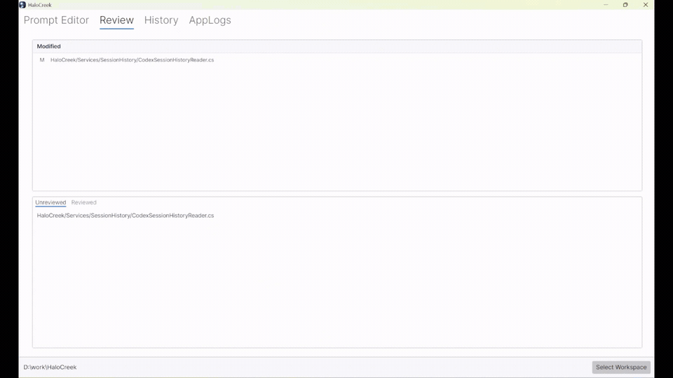
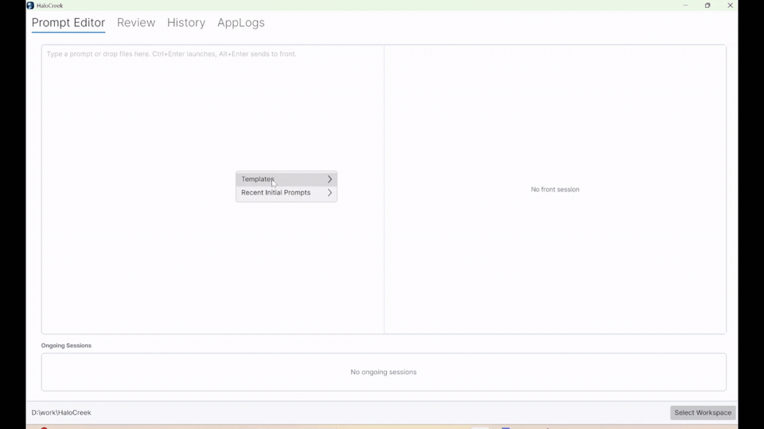

# Stay in Control While Coding with AI

Workflow shell for a better coding experience, powered by Codex CLI.

HaloCreek keeps the developer in the loop: launch tasks faster, follow cleaner agent conversations, jump between code and context, review changes, and commit without scattering the workflow across terminals and tools.

## 1. Launch an Agent Task in Seconds

Write a prompt, pick the workspace, and send it to Codex CLI from one focused entry point.

No terminal setup dance. No path copying. Just describe the task and start.

## 2. A Quieter Agent Conversation

Read the agent's progress in a cleaner conversation view built for long coding sessions.

HaloCreek keeps the useful parts visible: your prompt, the assistant response, code blocks, links, task state, and recent context.

## 3. Reach Your Agent from Anywhere

When a piece of code needs follow-up, keep the context close.

Jump from an agent message to the related file, inspect it in your editor, then ask a follow-up without rebuilding the whole prompt from scratch.

## 4. Review, Follow Up, and Commit in One Workflow

Agent coding still needs human judgment.

HaloCreek helps you track modified files, separate reviewed work from fresh changes, send review feedback back to the active session, and move toward commit with less window switching.

## 5. Build Better Prompts, Faster

Prompting is part of the workflow, not a throwaway text box.

Reuse earlier prompts, shape structured instructions, and send clearer tasks to the agent with less repetitive typing.

## Setup Now

- Install: https://xianyu603.github.io/HaloCreek/
- Latest Release: https://github.com/xianyu603/HaloCreek/releases/latest
- [other install method] from GitHub action
- Contact Author: cuikai603@163.com
